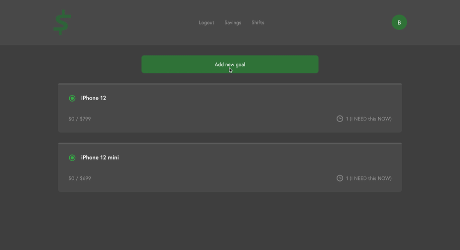
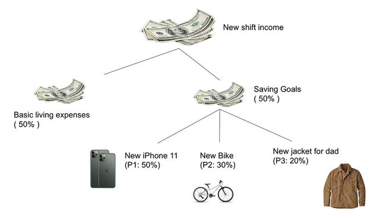
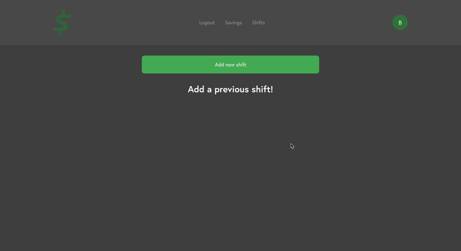
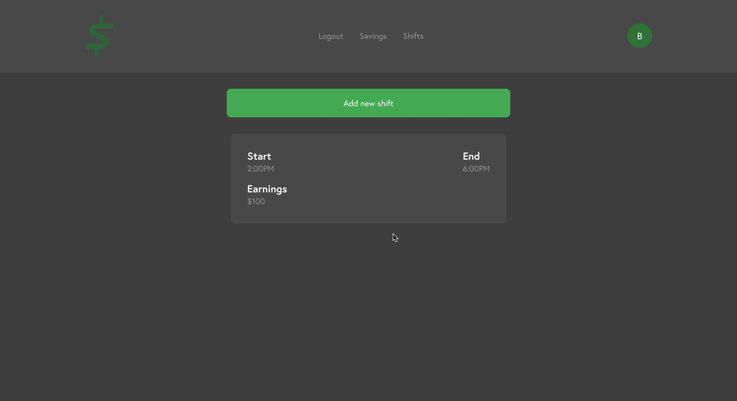

# Swurf-Savings-Backend
We are Swurf Savings: a savings tool made by ride-share drivers, for ride-share drivers.

</img>
<br /><br />

## Table of Contents
* [About The Project](#about-the-project)
  * [Main Logic](#main-logic)
  * [Data Structure](#data-structure)
  * [Usage](#usage)
  * [Stretch Goals](*stretch-goals)
  * [Build With](#build-with)
* [Getting Started](#getting-started)
  * [Installation](#installation)
  * [API Routes](#api-routes)
* [Authors](#Authors)
* [Contact](#contact)
<br /><br />

## About The Project

Swurf Savings is a web application that allows users to track their progress toward different savings goals with three tiers of importance based on what they prioritize.  The user has the ability to add/store their driving shifts which will impact the progress bars for each goal, calculated using its selected priority.  Using average shift income, which changes every time the user uploads a shift, the app provides accurate updates to the number of shifts required to reach a savings goal.

### Main Logic

</img>

e.g. 
John has 3 savingGoals
  - Priority 1: A new iPhone 11 ($699)
  - Priority 2: A new Bike ($300)
  - Priority 3: A new jacket for his dad ($100)

He finished a new shift from 6pm -9pm. He got 100 totally, and he posted it on Swurf. He needs 50% of the income ($50) for basic living, and within the remaining $50:
  - 50% ($25) is for his priority 1 savingGoal(new iPhone 11)
  - 30% ($15) is for his priority 2 savingGoal(new bike)
  - 20% ($10) is for his priority 3 savingGoal(new jacket)

Now the price_remaining for each savingGoal changed:
  - Priority 1: A new iPhone 11 ($699 - $25 = $674)
  - Priority 2: A new Bike ($300 - $15 = $285)
  - Priority 3: A new jacket for his dad ($100 - $10 = $90) 

We use averageShiftIncome = totalIncome / totalShiftWorked to calculate the averageShiftIncome, and use shiftRemaining = price_remaining / (averageShiftIncome * 50% * priority）to calculate the shiftRemaining for certain savingGoal.

### Data Structure

For each user, he/she has the following properties:
- username
- email
- password
- time-created (auto-created)

- shifts (Array) 
  > Each shift in shifts array has the following properties:
  - id
  - income
  - start_time
  - end_time
  - time_created (auto-created)
  - isDeleted (default: false. The user can delete the shift after he posted it. This record will still stay is the shifts array, but it will not be used for calculation.)
  
- savingGoals (Array) 
  > Each savingGoal in savingGoals array has the following properties:
  - id
  - title
  - price 
  - price_remaining (will decrease every time when the user post a new shift.)
  - priority (1/2/3)
  - time_created (auto-created)
  - isDeleted (default: false. The user can delete the savingGoal after he posted it. This record will still stay in the savingGoals array, but it will not be used for calculation.)
  - isAchieved (default: false. When the price_remaining of certain savingGoal <= 0, the isAchieved value will change to true.   This record will still stay is the savingGoals array, but it will not be used for the future calculation. )

### Usage
1. Post new saving goals:
*e.g.: I want to buy a $55 new jacket for my dad with medium priority.*
</img>
<br />

2. Post new shifts:
*e.g.: I fished a Uber shift from 2:00 pm to 6:00 pm today. .*
</img>
<br />

3. The system will automatically updated the progress bar, so the user will know how close they are to their saving goals.
</img>
<br />

### Stretch Goals
* Use Plaid API for bank account linking.
* Use Uber driver and other API to submit new shift automatically.
* Use different calculation for rush hour & non rush hour.

### Build With
* Node.js
* Express.js
* Mongo DB Atlas
<br />

## Getting Started

### Installation

1. Clone the repo to local:
```
git clone https://github.com/andrewlin618/Swurf-Savings-Backend.git
cd Swurf-Savings-Backend
```

2. Install the dependencies for Server:
* "axios": "^0.19.0",
* "bcryptjs": "^2.4.3",
* "body-parser": "^1.19.0",
* "concurrently": "^5.0.0",
* "cors": "^2.8.5",
* "express": "^4.17.1",
* "is-empty": "^1.2.0",
* "jsonwebtoken": "^8.5.1",
* "moment": "^2.24.0",
* "mongoose": "^5.7.7",
* "passport": "^0.4.0",
* "passport-jwt": "^4.0.0",
* "plaid": "^4.3.0",
* "validator": "^12.0.0"

```
npm install
```

3. Run the app with:
```
npm start
```


4. Test it with following URL (using Postman etc.):
```
http://localhost:5000/
```

### API Routes
ROOT URL: [Swurf API](http://www.swurfapi.heroku.com)
**Shift Routes:**

<span style="color:blue">GET</span> &emsp;/:username/allShifts
*Get all shifts of certain user (including deleted shifts)*

<span style="color:blue">GET</span> &emsp;/:username/shifts  
*Get all shifts of certain user (not including deleted shifts)*

<span style="color:red">DELETE</span> &emsp;/:username/shifts
*Delete all shifts of certain user*

<span style="color:green">POST</span> &emsp;/:username/shifts
*Post a new shift of certain user*
  
<span style="color:blue">GET</span> &emsp;/:username/shift/:id
*Get certain shift of certain user by id*

<span style="color:red">DELETE</span> &emsp;/:username/shift/:id
*Delete certain shift of certain user by id*

**Saving goals:**

<span style="color:blue">GET</span> &emsp;/:username/allSavingGoals
*Get all saving goals of certain user (including deleted or achieved saving goals)*

<span style="color:blue">GET</span> &emsp;/:username/savingGoals
*Get all saving goals of certain user (not including deleted or achieved saving goals)*

<span style="color:red">DELETE</span> &emsp;/:username/savingGoals
*Delete all saving goals of certain user*

<span style="color:green">POST</span> &emsp;/:username/savingGoals
*Post a new saving goal of certain user*
  
<span style="color:blue">GET</span> &emsp;/:username/savingGoal/:id
*Get certain saving goal of certain user by id*

<span style="color:red">DELETE</span> &emsp;/:username/savingGoal/:id
*Delete certain saving goal of certain user by id*
<br />

## Authors
* **Ronak Patel**
* **Andrew Lin**
* **Leah Munson**
* **Nicole Roberts**

## Contact
- LinkedIn: [Andrew Lin](https://www.linkedin.com/in/andrewlin618)
- Email:    &nbsp; &nbsp; `andrewlin618@gmail.com`
